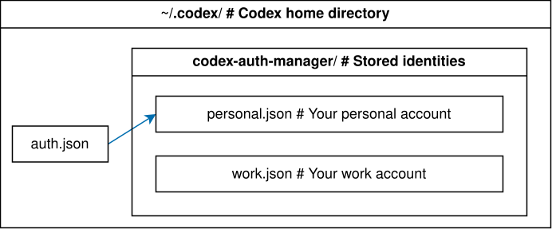

# codex-auth-manager (cam)

[](https://github.com/PRO-2684/codex-auth-manager/blob/main/LICENSE)
[](https://github.com/PRO-2684/codex-auth-manager/blob/main/.github/workflows/release.yml)
[](https://github.com/PRO-2684/codex-auth-manager/releases)
[](https://github.com/PRO-2684/codex-auth-manager/releases)
[](https://crates.io/crates/codex-auth-manager)
[](https://crates.io/crates/codex-auth-manager)
[](https://docs.rs/codex-auth-manager)

A deadly simple Codex auth manager / account switcher. Nothing more, nothing less. Change your Codex auth while keeping all your settings, skills and history.



## 📥 Installation

### Using [`binstall`](https://github.com/cargo-bins/cargo-binstall)

```shell
cargo binstall codex-auth-manager
```

### Downloading from Releases

Navigate to the [Releases page](https://github.com/PRO-2684/codex-auth-manager/releases) and download respective binary for your platform. Make sure to give it execute permissions.

### Compiling from Source

```shell
cargo install codex-auth-manager --features=cli
```

## 📖 Usage

`cam` manages named Codex auth identities. Each identity is stored under `$CODEX_HOME/codex-auth-manager/`, and CAM switches which identity Codex sees at `$CODEX_HOME/auth.json`.

- `cam` / `cam status` — show the current auth state and available account details
- `cam list` — list saved identities and available account details
- `cam capture <identity> [--force]` — save the current native Codex auth file as an identity and make it active
- `cam use <identity> [--force]` — make an existing identity active
- `cam detach [--force]` — stop using the active CAM-managed identity

<details><summary>Shell Completions</summary>

Shell completions can be generated by `cam` and include saved identity names for commands like `cam use`. For Bash:

```shell
mkdir -p ~/.local/share/bash-completion/completions
echo 'source <(COMPLETE=bash cam)' > ~/.local/share/bash-completion/completions/cam
```

Other shells [supported by `clap_complete`](https://docs.rs/clap_complete/latest/clap_complete/aot/enum.Shell.html#variants) can generate their setup script with `COMPLETE=<shell> cam`.

</details>

## 💡 Examples

Say that you've logged into Codex with your personal account. Now you've got a new work account, and you want to switch between them without logging in and out every time. With `cam`, you can capture your auth states as identities, which can be switched back to at any time.

```shell
# Capture the current auth state as "personal" identity
cam capture personal
```

Now `auth.json` is moved to `$CODEX_HOME/codex-auth-manager/personal.json`, and a symlink is created at `$CODEX_HOME/auth.json` pointing to it. Then you `detach` the current identity (which basically removes the symlink) and log in to Codex with your work account:

```shell
# Detach the current identity
cam detach
# Log in to Codex with your work account as usual (e.g. via `codex login`)
```

You can capture the auth state again as "work" identity:

```shell
# Capture the current auth state as "work" identity
cam capture work
```

Now you have two identities saved. You can switch between them with `cam use`:

```shell
# Switch to "personal" identity
cam use personal
# Switch back to "work" identity
cam use work
```

To list all saved identities:

```shell
$ cam list
  personal — Example User <personal@example.com>
* work — Example User <work@example.com>
```

The active identity is marked with `*`. CAM reads the display name and email from each identity's
ID token when available. Missing or malformed details do not prevent an identity from being listed.

## Library feature

Enable the optional `identity-details` feature to read the same account details through the public
library API:

```shell
cargo add codex-auth-manager -F identity-details
```

`Identity::read_details` reads a saved identity, while
`CodexAuthManager::read_active_auth_details` supports both native and managed active auth files.
The returned `IdentityDetails` implements `Display` as `Name <email>`, with either missing field
omitted.
